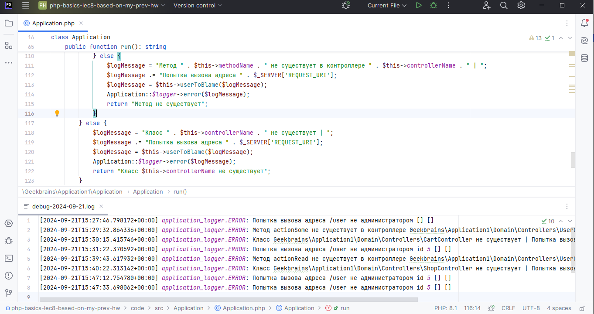

# PHP BASICS. Workshop 8. Homework. Тогочакова Евгения

В уже созданных маршрутах попробуйте вызывать их с некорректными данными. Что будет происходить? Будут ли появляться ошибки?

При появлении ошибок, произведите их анализ. Обязательно зафиксируйте шаги своих размышлений.
На основании анализа произведите устранение.

Создан специальный класс Memory для учета объема памяти, выделенного скрипту для выполнения запросов.
Эту возможность - собирать логи в базу данных- можно включать-выключать при необходимости через config.ini

Добавлено логирование некоторых исключительных ситуаций: например, пользователь пытается выполнить метод, который
доступен только админу; вызов контроллера, которого не существует, или метода, который не существует.
Также, если такая информация есть, в логи добавляется id пользователя, чьи действия вызвали исключение.
За это ответственен дополнительный метод в Application userToBlame()

К форме создания пользователя подключен JS - файл user-form.js.
Незаполненные поля обводит красной рамкой и на уровне браузера не дает отправить пустую форму. 
Остальная логика, где работает PHP, прежняя.